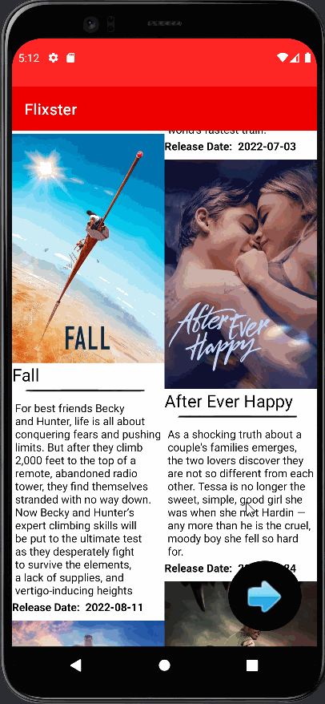

# Android Project 4 - *Flixster 2.0*

Submitted by: **Corey Smith**

**Flixster 2.0** is a movie browsing app that allows users to browse movies now playing and see the top trending movies out now.
Trending movies can be further explored for movie overviews, and voting details.

Time spent: **15** hours spent in total

## Required Features

The following **required** functionality is completed:

- [x] **Choose any endpoint on The MovieDB API except `now_playing`**
  - Chosen Endpoint: `/3/trending/movie/week`
- [x] **Make a request to your chosen endpoint and implement a RecyclerView to display all entries**
- [x] **Use Glide to load and display at least one image per entry**
- [x] **Click on an entry to view specific details about that entry using Intents**

The following **optional** features are implemented:

- [x] **Add another API call and RecyclerView that lets the user interact with different data.** 
- [ ] **Add rounded corners to the images using the Glide transformations**
- [x] **Implement a shared element transition when user clicks into the details of a movie**

The following **additional** features are implemented:

- [x] Navigation buttons between activities
- [x] Custom styling
- [x] API calls and JSON parsing with Retrofit and Moshi

## Video Walkthrough

Here's a walkthrough of implemented user stories:

GIF created with GIF Maker-Editor 

## Notes

**Integrating your API Key:**
Under the app level view in Andriod Studio, inside the *Gradle Scripts* package
add API_KEY="<your api key>" to the file *local.properties*

Describe any challenges encountered while building the app.

Long load times for API calls in the emulator caused me to start using my phone in debug mode.
Learning more: I wanted to really understand JSON parsing, so I did a lot of research for this one;
I have a good grasp on Gson, Serialization, and Moshi parsing.
Glide transformations ruined display constraints, making large gaps between viewholders in the RecyclerViews and I never figured out how to stop it

## License

    Copyright [2022] [Corey Smith]

    Licensed under the Apache License, Version 2.0 (the "License");
    you may not use this file except in compliance with the License.
    You may obtain a copy of the License at

        http://www.apache.org/licenses/LICENSE-2.0

    Unless required by applicable law or agreed to in writing, software
    distributed under the License is distributed on an "AS IS" BASIS,
    WITHOUT WARRANTIES OR CONDITIONS OF ANY KIND, either express or implied.
    See the License for the specific language governing permissions and
    limitations under the License.
